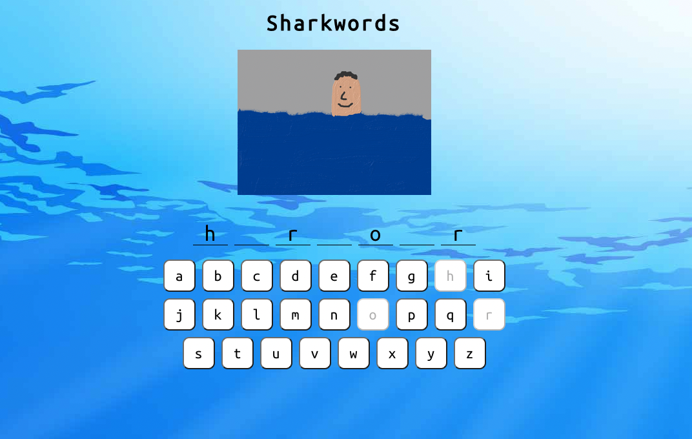

# Sharkwords

A word-guessing game made with React. Guess the words before the shark gets you 🦈

## Set Up

To deploy this project, first clone or fork this repository.
Then in the project directory, configure the app using:

```bash
  npm install
```

Run the app using the following and play the game at http://localhost:3000:

```bash
  npm start
```

## Screenshots




